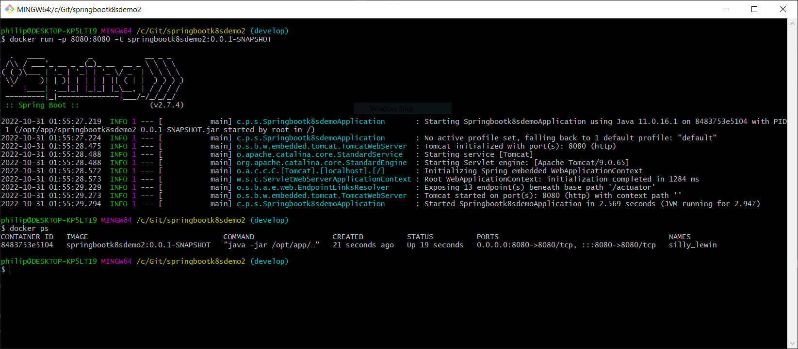

# Developer's Journal

## October 16, 2022 - Philip Posgate

In **CHAPTER 2** we'll continue to expand the API's definitions in the kustomize yaml files (aka: the Kubernetes manifest). 

In the previous chapter I used kubectl to generate a single **deployment.yaml** file that was enough to make a rudimentary deployment in my local Kubernetes cluster.  This time we'll setup the Kustomize yaml files properly.

The following is an example of how the ```kubernetes``` directory structure should look like...

```
/kubernetes
├── base
│   ├── deployment.yaml
│   ├── hpa.yaml
│   ├── kustomization.yaml
│   └── service.yaml
└── overlays
    ├── dev
    │   ├── hpa.yaml
    │   └── kustomization.yaml
    ├── production
    │   ├── hpa.yaml
    │   ├── kustomization.yaml
    │   ├── rollout-replica.yaml
    │   └── service-loadbalancer.yaml
    └── staging
        ├── hpa.yaml
        ├── kustomization.yaml
        └── service-nodeport.yaml
```

...so above you have a **base** configuration that defines those configs which are common to all environments.  And then you have environment specific **overlays** which extend and/or override the base config.

The only yaml file that's mandatory is the ```kustomization.yaml``` file. It has to be created in the **base** directory, and also in each **overlay** directory.  All the other yaml files are used in reference from the kustomization.yaml file.  

In order to deploy to a particular environment, you would execute ```kubectl apply -k <thePathToOverlayDirectory>```.

e.g. 

* to deploy to "dev" execute ```kubectl apply -k kubernetes/overlays/dev```
* to deploy to "production" execute ```kubectl apply -k kubernetes/overlays/production```

<br>

## October 30, 2022 - Philip Posgate

In CHAPTER 1, we built a docker image with the ```./gradlew bootBuildImage``` command.  This auto-generates a Dockerfile and then builds the Docker image.  In this chapter we change things...this time we add our own **Dockerfile** to the root of the project.  This gives us total control of the Docker image we're building.  But it also means we have to manually build it with:

```
docker build -t springbootk8sdemo2:0.0.1-SNAPSHOT .
```

...and then we can run it with:

```
docker run -p 8080:8080 -t springbootk8sdemo2:0.0.1-SNAPSHOT
```

e.g.


...and now we can hit the API at ```http://localhost:8080/actuator```
